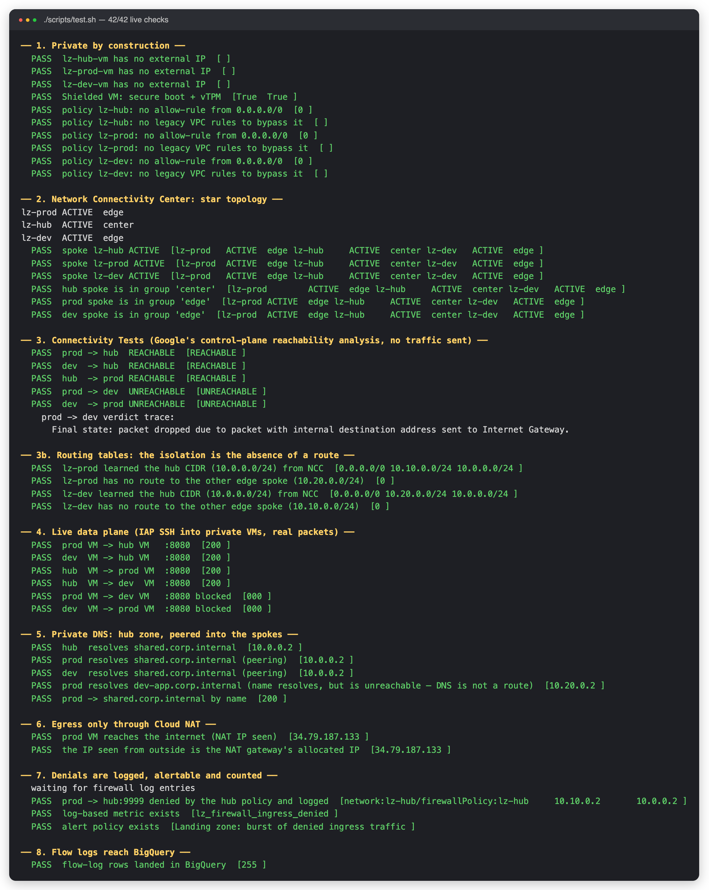
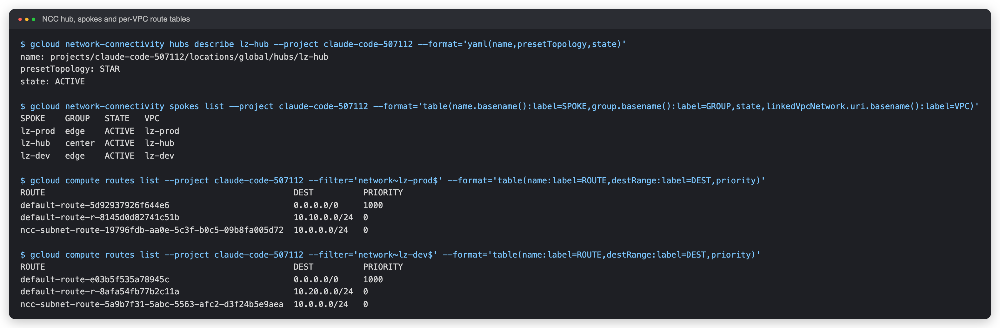
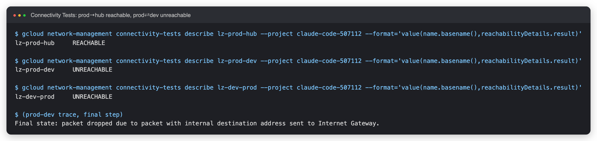
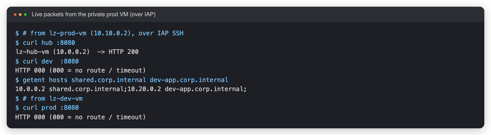
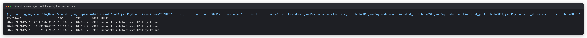

# Hub-and-Spoke Network Landing Zone on Google Cloud

A production-shaped **network foundation** on GCP: three VPCs joined by **Network Connectivity Center in star topology** so prod and dev can each reach shared services in a hub but **never each other**; default-deny firewall policies with logged denials; private-only VMs reached through **Identity-Aware Proxy**; centralised private DNS; Cloud NAT egress; flow logs in BigQuery — provisioned and destroyed by **one script each**.

> **Status: deployed and verified live** (europe-west1, 2026-09-26). `./scripts/up.sh` applied 71 resources on the first run and [`scripts/test.sh`](scripts/test.sh) passes **42 of 42** ([results](docs/test-results.md)). The isolation claim is proven three ways: Google's Connectivity Tests, the VPC route tables, and real packets sent from inside the VPCs. Getting the test suite honest took several fixes (including a false pass) — see [troubleshooting](docs/runbooks/08-troubleshooting.md). The stack was then removed with `./scripts/down.sh`.

```bash
gcloud config set project <your-project>      # billing linked; the rest is auto-detected
./scripts/up.sh       # state bucket → 3 VPCs + NCC hub → firewall/NAT/DNS/logging → live tests
./scripts/down.sh     # delete everything (--purge also drops the state)
```

## Evidence (captured from the live deployment)

| | |
|---|---|
|  |  |
| **`scripts/test.sh`** — 42 checks across private-by-construction, NCC, routing, data plane, DNS, NAT, logging | **NCC + route tables** — prod learned `10.0.0.0/24` (hub) but has **no route** to `10.20.0.0/24` (dev) |

| | |
|---|---|
|  |  |
| **Connectivity Tests** — prod→hub `REACHABLE`; prod⇄dev `UNREACHABLE` (no route) | **Real packets** from the private prod VM: hub `200`, dev `000`; DNS resolves `dev-app` yet it is unreachable |

| |
|---|
|  |
| **Denials are evidence** — the explicit logged deny-all names the policy that dropped each probe |

The Cloud Console views are not included: the console needs an interactive Google sign-in that automation cannot perform. Evidence text lives in [`docs/evidence/`](docs/evidence) and is regenerated by [`scripts/capture-evidence.sh`](scripts/capture-evidence.sh).

## What it proves

| Concern | Mechanism | Proven by |
|---|---|---|
| **Environment isolation** | NCC **star**: hub = `center`, prod/dev = `edge`; edges reach the center, never each other. Spoke firewalls admit only the hub CIDR (second, independent layer) | Connectivity Tests, route tables (no `10.20.0.0/24` in prod), live `curl` → `000` |
| **No public exposure** | No external IPs, Shielded VMs, project SSH keys blocked | test §1 |
| **Admin access without a bastion** | SSH only via **IAP** + OS Login, granted by IAM | every live check runs over the IAP tunnel |
| **Visible denials** | Explicit, *logged* deny-all (the implicit deny is silent) → log-based metric → alert | test §7 |
| **One place for names** | Private zone in hub, DNS-peered into spokes; DNS query logging | test §5 |
| **Controlled egress** | Cloud NAT per VPC, outbound only | test §6 (the internet sees the NAT IP) |
| **Auditability** | VPC flow logs (5 s) → BigQuery; NAT/DNS/firewall logs | test §8 |
| **FinOps** | Budget alerts; ≈ €0.5–1/day while running, €0 after `down.sh` | [runbook 07](docs/runbooks/07-cost.md) |

## Architecture

[](docs/img/architecture.svg)

<sub>Click for the vector version. Diagram source: [`docs/diagrams/architecture.py`](docs/diagrams/architecture.py).</sub>

| from \ to | hub | prod | dev |
|---|---|---|---|
| **hub** | – | ✅ | ✅ |
| **prod** | ✅ | – | ❌ |
| **dev** | ✅ | ❌ | – |

More: [architecture](docs/architecture.md) · [threat model](docs/threat-model.md)

## Design decisions

| ADR | Decision |
|---|---|
| [0001](docs/adr/0001-ncc-star-over-peering-and-shared-vpc.md) | NCC star over VPC peering / Shared VPC / mesh |
| [0002](docs/adr/0002-iap-instead-of-bastion.md) | IAP + OS Login instead of a bastion or public IPs |
| [0003](docs/adr/0003-explicit-logged-deny.md) | Explicit, logged deny-all in every firewall policy |
| [0004](docs/adr/0004-dns-peering-not-a-route.md) | One private zone in the hub, DNS-peered; a name is not a route |

## Runbooks

[docs/runbooks](docs/runbooks/README.md): build & teardown · reach a private VM · add a spoke · diagnose connectivity · observability queries · incident response · cost · troubleshooting.

## Repository layout

```
terraform/            root (NCC hub + spokes, DNS, IAM, observability) + modules/vpc (VPC, subnet, NAT, firewall policy, VM)
scripts/              up.sh · down.sh · test.sh · capture-evidence.sh · lib.sh · bootstrap.sh
docs/                 architecture · ADRs · runbooks · threat model · evidence · diagrams
.github/workflows/    fmt/validate · Trivy IaC scan · shell syntax
```

## Known gaps (deliberate)

No on-prem link (Cloud VPN / Interconnect) · no centralised egress inspection (Cloud NGFW Enterprise / NVA) · no VPC Service Controls or org policies (need organisation admin) · single region · workloads are a tiny HTTP probe, not real services.

## License

MIT
