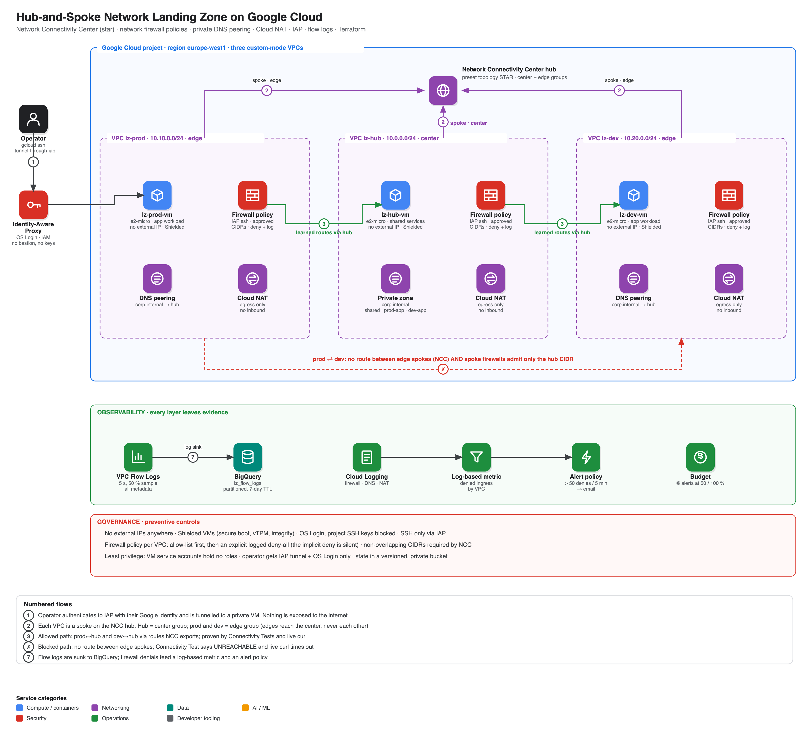

# Architecture

## Layers

| Layer | Resources | Purpose |
|---|---|---|
| Connectivity | 3 custom-mode VPCs, 1 NCC hub (`STAR`), 3 VPC spokes | hub = `center`, prod/dev = `edge` |
| Perimeter | 3 network firewall policies (allow-list + logged deny), IAP-only SSH | default-deny, evidence on every drop |
| Egress | 3 Cloud NAT gateways (`ERRORS_ONLY` logging) | outbound-only; VMs have no public IPs |
| Names | private zone `corp.internal.` in hub, 2 peering zones, DNS query logging | one place for records |
| Workload | 3 × e2-micro Debian 12, Shielded VM, OS Login | tiny HTTP service on :8080 as a probe target |
| Evidence | flow logs → BigQuery, firewall log-based metric, alert policy, budget | see [runbook 05](runbooks/05-observability.md) |

## Address plan

| VPC | CIDR | NCC group |
|---|---|---|
| lz-hub | 10.0.0.0/24 | center |
| lz-prod | 10.10.0.0/24 | edge |
| lz-dev | 10.20.0.0/24 | edge |

Reserve `10.30.0.0/16`+ for future spokes; NCC rejects overlaps.

## Reachability matrix (asserted by `scripts/test.sh`)

| from \ to | hub | prod | dev |
|---|---|---|---|
| **hub** | – | ✅ | ✅ |
| **prod** | ✅ | – | ❌ no route, ❌ firewall |
| **dev** | ✅ | ❌ no route, ❌ firewall | – |

Verified two independent ways: Google's Connectivity Tests (control-plane analysis) and real `curl` over IAP SSH (data plane).
